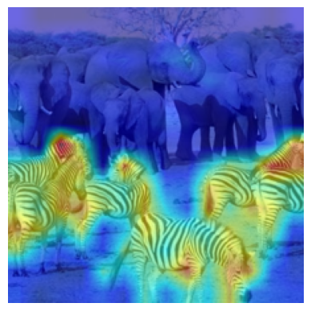

[](https://opensource.org/licenses/MIT) 
 


# txv (Transformer eXplainability - Vision)

txv is a vision transformers explainability package. It provides CAM like visualization for vision transformers. It is built on the top of [transformerinterp](https://github.com/jiaminchen-1031/transformerinterp) and [Transformer-Explainability](https://github.com/hila-chefer/Transformer-Explainability) repositories.

<br>

Website : [Home Page](https://lokeshbadisa.github.io/txv/)<br>
Documentation : [Documentation](https://lokeshbadisa.github.io/txv/api_reference)<br>
Tutorial : [Tutorials](https://lokeshbadisa.github.io/txv/tutorials)

<br>

## Installation
  
  ### For Users
  ```bash
  pip install txv
  ```

  ### For Development/latest version
  ```bash
  git clone git@github.com:LokeshBadisa/txv.git
  cd txv
  pip install -e .
  ```


## Example

```python
from txv.exp import BeyondIntuition
from txv.utils import *
from txv.vit import vit_base_patch16_224

device = torch.device('cuda:0')
model = vit_base_patch16_224().to(device)

image = read_image('./images/zebra-elephant.png').to(device)
output = model(image)
print_top_classes(output)
```

Output:
```
Top 10 classes:
        340 : zebra                                             value = 12.749   prob = 94.2%
        386 : African elephant, Loxodonta africana              value = 9.485    prob = 3.6%
        101 : tusker                                            value = 7.923    prob = 0.8%
        385 : Indian elephant, Elephas maximus                  value = 7.684    prob = 0.6%
        352 : impala, Aepyceros melampus                        value = 5.946    prob = 0.1%
        351 : hartebeest                                        value = 5.460    prob = 0.1%
        343 : warthog                                           value = 5.416    prob = 0.1%
        9 : ostrich, Struthio camelus                           value = 5.292    prob = 0.1%
        353 : gazelle                                           value = 5.248    prob = 0.1%
        293 : cheetah, chetah, Acinonyx jubatus                 value = 4.881    prob = 0.0%
```

<br>

```python
bi = BeyondIntuition(model)
mask_bih = bi.explain(image,method='head')
mask_bit = bi.explain(image,method='token')

inp1,mask_bih = postprocess(image,mask_bih)
cam1 = show_exp_on_image(inp1[0],mask_bih[0])
inp2,mask_bit = postprocess(image,mask_bit)
cam2 = show_exp_on_image(inp2[0],mask_bit[0])

plt.subplot(1,2,1)
plt.imshow(cam1)
plt.axis('off')

plt.subplot(1,2,2)
plt.imshow(cam2)
plt.axis('off')

plt.show()
```
<table>
  <tr>
    <td>
      
      <br>
      <p style="text-align: center;">Beyond Intuition - Head wise</p>
    </td>
    <td>
      
      <br>
      <p style="text-align: center;">Beyond Intuition - Token wise</p>
    </td>
  </tr>
</table>


<br>

> Note that currently txv supports models only in [`txv.vit`](https://lokeshbadisa.github.io/txv/vit.html) module. 


